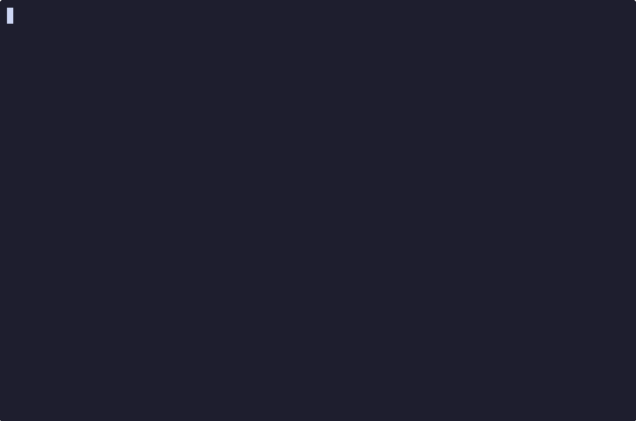

# tabitha

An async, event-driven TUI framework built on [ratatui](https://github.com/ratatui-org/ratatui) and [tokio](https://tokio.rs/).


[](https://asciinema.org/a/qkqijJT7T68xSYZT)

## Overview

Tabitha provides a clean, power-efficient architecture for building terminal user interfaces. It's designed around an event-driven model that only redraws when necessary, making it ideal for applications that need to minimize CPU usage.

## How It Works

Tabitha follows a component-based architecture where you build your UI by implementing the `Component` trait. The framework handles event routing, focus management, and drawing coordination automatically. Events flow through your components, which can handle them or pass them along. Background tasks can communicate with the UI via typed message channels.

The framework manages three main concerns:
- **Event Loop**: Routes terminal events (keyboard, mouse, resize) and task messages to components
- **Focus System**: Handles keyboard navigation between focusable elements
- **Drawing**: Coordinates UI rendering with theme support and automatic redraws on state changes

## Core Capabilities

- **Components**: Build UI elements by implementing `Component` - handle events and draw with `ratatui`
- **Tabs**: Built-in tab management with runtime enable/disable
- **Focus Management**: Automatic keyboard navigation between focusable components
- **Background Tasks**: Async tasks that communicate with UI via typed message channels
- **Theming**: Theme system with semantic color roles and automatic dimming for modals
- **Modals**: Modal dialog system with automatic backdrop dimming
- **Widgets**: Pre-built interactive widgets (TextBox, DataTable) that work with the focus system

## Quick Start

```rust
use tabitha::{AppBuilder, Component, MainUi, Event, AppContext, DrawContext, EventResult};
use ratatui::{Frame, layout::Rect, widgets::Paragraph};

struct MyApp;

impl Component for MyApp {
    fn draw(&self, frame: &mut Frame, area: Rect, ctx: &DrawContext) {
        frame.render_widget(Paragraph::new("Hello, tabitha!"), area);
    }

    fn handle_event(&mut self, event: &Event, ctx: &mut AppContext) -> EventResult {
        if event.is_quit() {
            ctx.quit();
            return EventResult::Handled;
        }
        EventResult::Unhandled
    }
}

impl MainUi for MyApp {}

#[tokio::main]
async fn main() -> Result<(), Box<dyn std::error::Error>> {
    let app = AppBuilder::new()
        .main_ui(MyApp)
        .build()?;

    app.run().await?;
    Ok(())
}
```

## Key Concepts

### Components

Components are the building blocks of your TUI. They implement `draw()` to render UI and `handle_event()` to process input. Components can declare themselves focusable to participate in keyboard navigation.

### Contexts

Two context types provide access to framework functionality:
- **`DrawContext`**: Available during rendering - access theme, tabs, focus state
- **`AppContext`**: Available during event handling - control app lifecycle, tabs, focus, modals

### Tabs

Tabs provide multi-page navigation. Register tabs at build time, then use `ctx.tabs()` to draw the tab bar and switch between tabs at runtime.

### Theme System

The framework includes a theme system with semantic color roles. Themes can be customized and swapped. When modals are displayed, the background automatically uses a dimmed (grayscale) version of the theme.

## Installation

```toml
[dependencies]
tabitha = "0.0.1"
ratatui = "0.30"
tokio = { version = "1", features = ["rt-multi-thread", "macros"] }
```

## Examples

```bash
cargo run --example counter      # Counter with background task
cargo run --example tabs         # Tab navigation
cargo run --example modal        # Modal dialogs
cargo run --example textbox      # Text input widgets
cargo run --example datatable    # Interactive data tables
```

## License

Licensed under either of:

- Apache License, Version 2.0 ([LICENSE-APACHE](LICENSE-APACHE) or http://www.apache.org/licenses/LICENSE-2.0)
- MIT license ([LICENSE-MIT](LICENSE-MIT) or http://opensource.org/licenses/MIT)

at your option.
